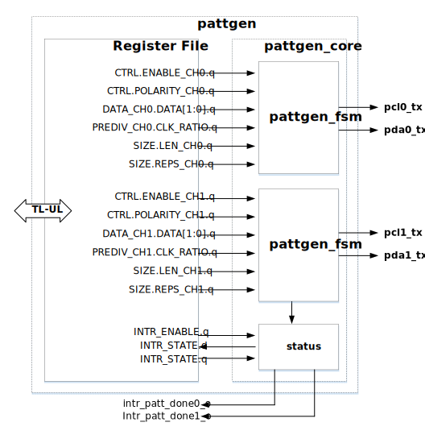

# Theory of Operation

The pattern can be started (or halted) on either channel by setting the corresponding [`CTRL.ENABLE`](registers.md#ctrl) bit to 1 (or 0) for the desired channel.
Once disabled, either channel can be configured independently.
The channel parameters (i.e. clock divider ratio, clock polarity, pattern length, pattern data, and repetition count) can all be programmed on a per-channel basis.
Enabling the pattern generator channel starts the pattern from the beginning.

Please note that writes to a channel's configuration registers have no effect while the channel is enabled.
For operational simplicity, the configuration registers are only transferred into the internal finite state machines while a channel is disabled.
Changes to the configuration registers only take effect once the channel has been disabled and re-enabled.

## Block Diagram

## Design Details

The design consists of two identical and independent finite state machines, each an instance of module `pattgen_fsm`.
Each FSM is essentially three nested counters, with one counter to control the clock division, another to count out the sequence bits, and a third to keep count of the number of repetitions.

Each FSM consists of
- Inputs:
    - `clk_io`, `reset`, `enable`, `clk_pre_divide`, `pattern`, `pattern_size`, `polarity`,  and `n_repeats`
- Outputs:
    - `pda` and `pcl`
- a single state variable with three states `IDLE`, `ACTIVE`, and `END`,
- a clock-divide counter, `clk_div`,
- a single clock-divide flop, `clk_int`, and
- two additional internal counters `bit_ctr` and `repeat_ctr`.

Each FSM is disabled when `enable` is low.
Disabling the FSM is equivalent to an FSM reset, and both operations place the FSM in the `IDLE` state.
While in `IDLE`, the other state machine registers assume their default states:
The internal counters, the clock-divide, `bit_ctr` and `repeat_ctr` all reset to 0, as does `clk_int`.

Once the FSM is enabled, it transitions to the `ACTIVE` state.
The clock-divide counter `clk_div` increments every cycle, except when it overflows matching the value applied to the `clk_pre_divide` input.
Then `clk_div` resets to 0, toggling `clk_int` in the process.
Two overflow events result in a complete clock cycle, resulting in an internal clock frequency of:
$$f_{pclx}=\frac{f_\textrm{I/O clk}}{2(\textrm{CLK_RATIO}+1)}$$

The FSM clock output, `pcl`, is directly driven by `clk_int`, unless the `polarity` input is high, in which case `pcl` is inverted from `clk_int`.

The `bit_ctr` counter increments on every falling edge of `clk_int`, until it overflows at the pattern length based on the `pattern_size` input.

In the `ACTIVE` state, the FSM `pda` output is driven by a multiplexer, connected to the `pattern` input.
The value of `bit_ctr` selects the bit value from the appropriate sequence position, via this multiplexor.

Finally whenever `bit_ctr` overflows and reverts to zero, the `repeat_ctr` increments, and the pattern starts again.
Finally `repeat_ctr` overflows to zero as it reaches the input value `n_repeats`.
When this overflow occurs, the FSM transitions to the `END` state.
All counters halt, the `pda` data lines reset to zero, and an interrupt event is sent out to signal completion.

The entire sequence can be restarted either by resetting or disabling and re-enabling the FSM.

### Interrupts

The pattern generator HWIP provides two interrupt pins, `done_ch0` and `done_ch1`, which indicate the completion of pattern generation on the output channels.
These interrupts can be enabled/disabled by setting/un-setting the corresponding bits of the [`INTR_ENABLE`](registers.md#intr_enable) register.
To clear the interrupts, bit `1` must be written the corresponding bits of [`INTR_STATE`](registers.md#intr_state) register
